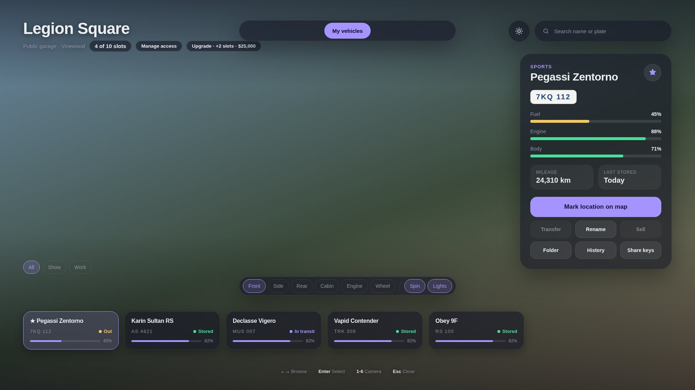
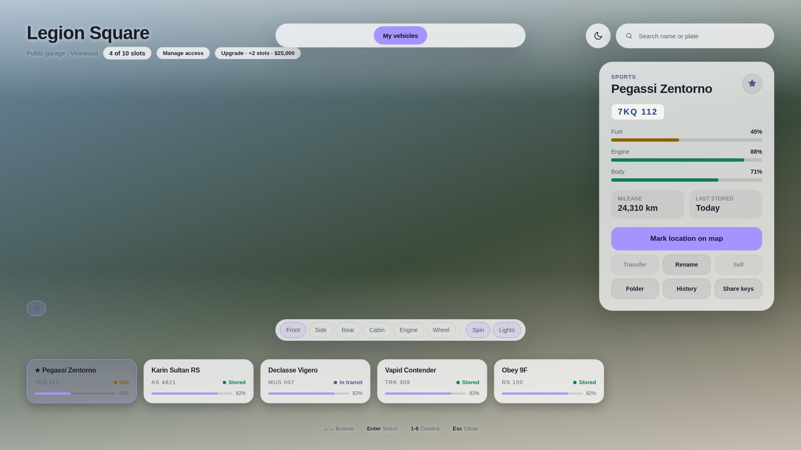
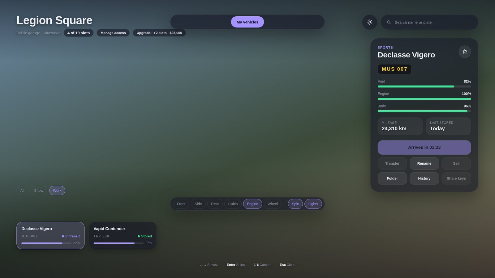
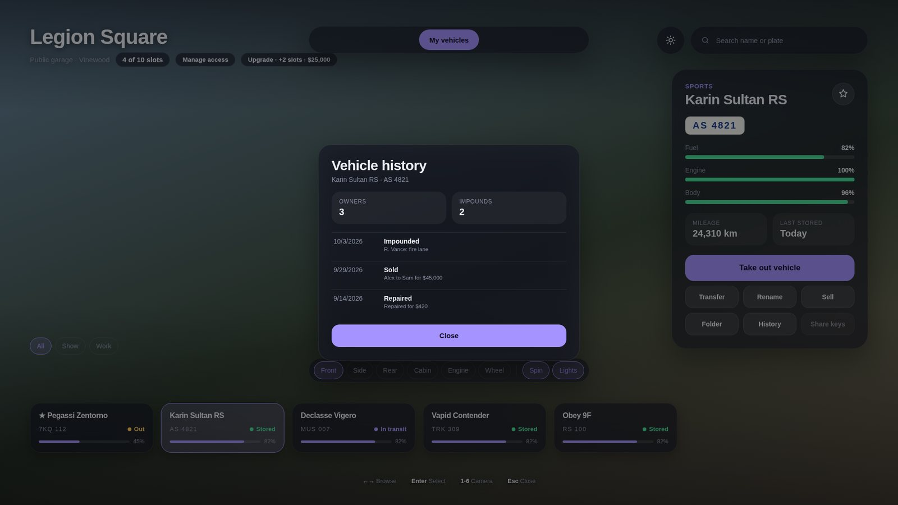
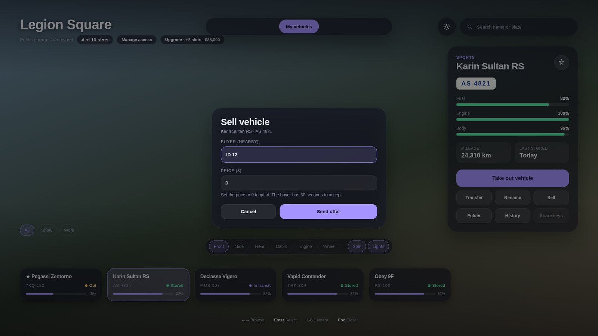
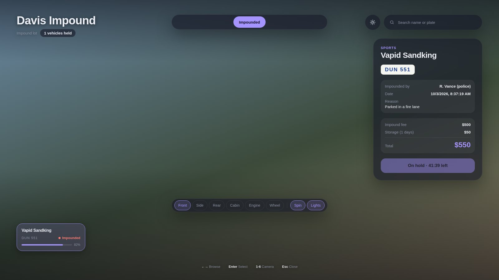
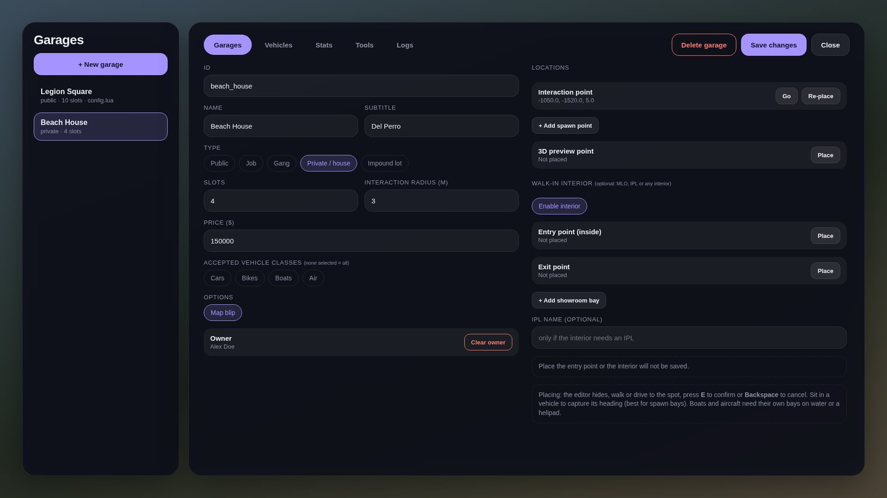
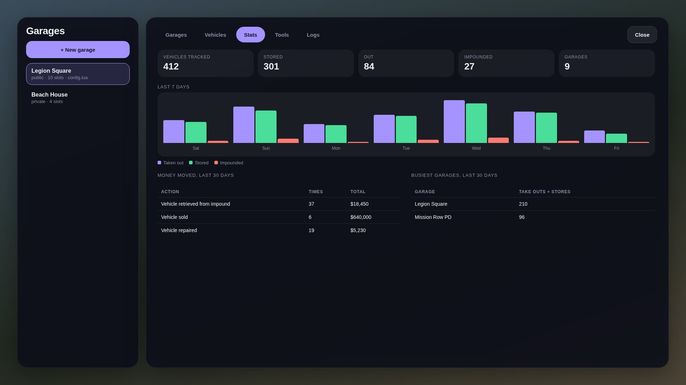
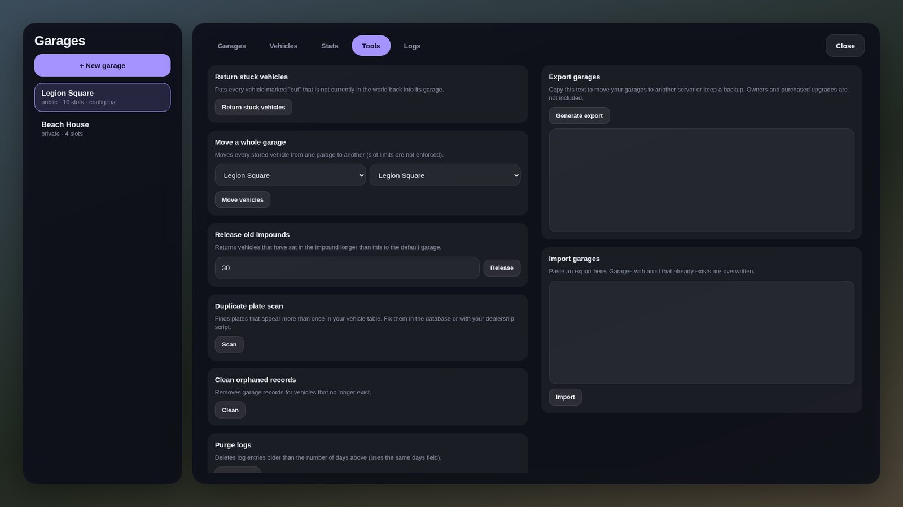

# as-garages

Modern garages and impound for FiveM. Works on **QBCore**, **Qbox** and **ESX** (auto-detected).

> Status: v0.3.1. The code has been syntax-checked but **not yet tested on a live server**. Expect to tune coordinates and fix small things on first run.

## Screenshots

These are rendered from the real UI code with sample data. In the game the background is the world, and the 3D vehicle preview (drawn by the game) sits in the middle of the screen.

| Light mode | Camera angles and folders |
| --- | --- |
|  |  |

| Vehicle history | Selling to a nearby player |
| --- | --- |
|  |  |

### Admin editor (`/asgarage`)

| Stats | Tools |
| --- | --- |
|  |  |

## Requirements

- [ox_lib](https://github.com/overextended/ox_lib)
- [oxmysql](https://github.com/overextended/oxmysql)
- One of `qbx_core`, `qb-core`, `es_extended`

## Quick start

1. Drop `as-garages` in your resources and `ensure` it after your framework, `ox_lib` and `oxmysql`.
2. `add_ace group.admin asgarages.admin allow`
3. Start the server. Tables are created automatically.
4. Run `/asgarage` in game to place your garages.

Guides: [Install](docs/INSTALL.md) · [Configuration](docs/CONFIGURATION.md) · [Admin](docs/ADMIN.md) · [API](docs/API.md) · [Housing](docs/HOUSING.md) · [Interiors](docs/INTERIORS.md) · [FAQ](docs/FAQ.md) · [Changelog](CHANGELOG.md)

## Features

- **Garage types:** public, job, gang, private / house (buy, share with members) and impound lots. Optional class filter (cars, bikes, boats, air).
- **Vehicle persistence:** fuel, engine and body health, mileage and all mods, via `ox_lib` vehicle properties.
- **Modern UI:** glass-style panels, 3D preview with the vehicle's real mods (six camera angles, turntable, headlights, drag to rotate), real plate styles, search, favourites, keyboard and gamepad control, live status, light and dark themes with your own accent colour, menu sounds and animations.
- **Walk-in interiors:** optional parked-car showroom inside any MLO or IPL.
- **Interaction:** `[E]` prompt, `ox_target`, `qb-target`, or both.
- **Player tools:** transfer between your garages (instant or delayed), rename, organise in folders, view a vehicle's history, repair, lend keys, and sell or gift to a nearby player with a buyer confirmation.
- **Impound:** `/impound` for officers (reason, fee, minimum hold, who can release). Owners pay the fee plus daily storage, officers release for free. Lost vehicles go to the impound or back to their garage.
- **Admin editor (`/asgarage`):** create and edit garages, place points in the world, browse and force-return vehicles, read the logs, a stats dashboard, bulk tools, a duplicate-plate scanner, and garage export and import.
- **Vehicles left on the road** are impounded or returned to their garage (configurable).
- **Integration:** server exports and events (`docs/API.md`), a temporary-garage API for housing scripts, keys and fuel hooks, Discord webhook logging.
- **Languages:** English, Spanish, French, German, Portuguese, Italian.

### Security

- Every action is checked on the server: ownership, job or gang, distance to the garage and slot limits. Players can only store vehicles they own.
- A vehicle's row is flipped atomically before anything spawns, so the same plate can't be taken out twice. If the spawn fails, the state and any fee are rolled back.
- Sales and transfers lock the plate, re-check everything after the buyer accepts, and refund on failure.
- The client never decides what is stored or charged. Props are sanitised and mileage is clamped.

## Known limits

- Private garages are bought, not rented.
- The admin editor is English only.
- No adapter ships for a specific housing resource. Use the [temporary garage API](docs/HOUSING.md).
- Phone app integration is not included yet (use `GetVehicleState` and the events).
- Gamepad support in the UI depends on the game's browser exposing it.
- Vehicles with no record are assumed to be parked in `Config.DefaultGarage`.
- The coordinates in `config.lua` are rough starting points. Re-place them with `/asgarage`.
